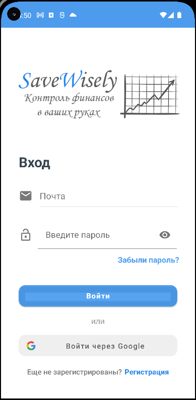
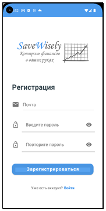
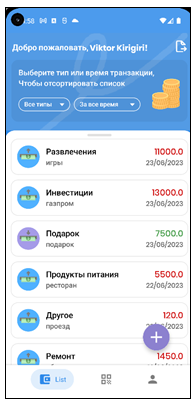
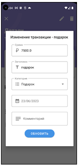
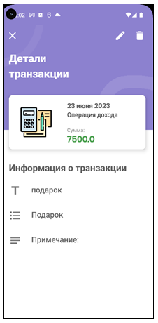
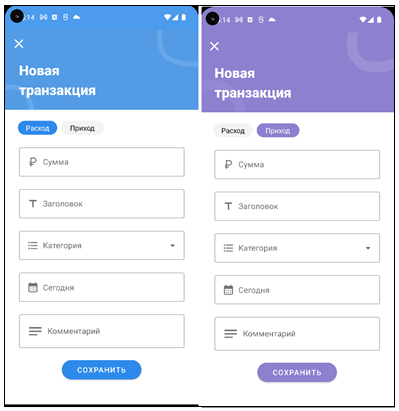
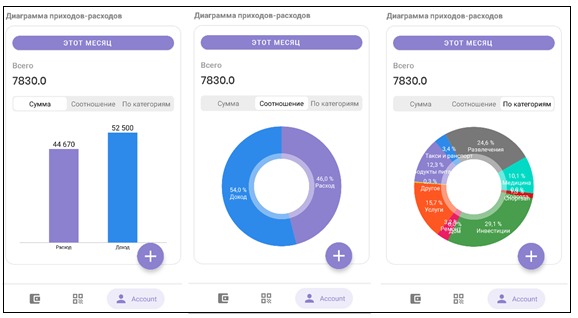
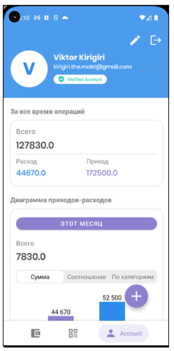
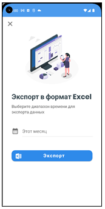

# Save Wisely
Простое приложения, которое позволяет вести учет доходов и расходов.

## Описание
Для реализации приложения были использованы Kotlin и Firebase Realtime Database(для хранения данных о транзакциях и авторизации).
Приложение позволяет:
*Внесение и работа с транзакциями;
*Экспорт данных в формате .xsl;
*Отображение транзакций по типу или времени;
*Сканирование QR-кодов с товарных чеков;

## Пользовательский интерфейс

 

 

